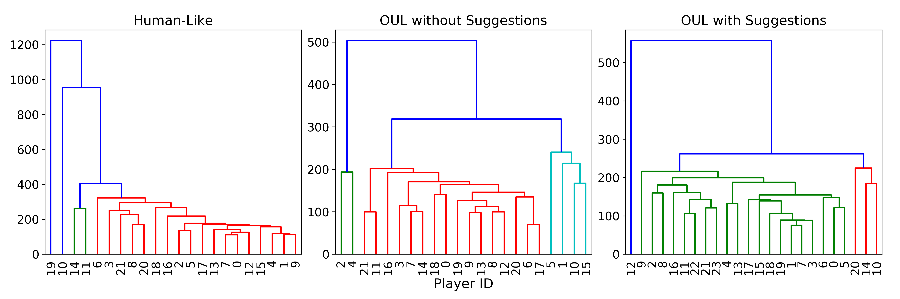
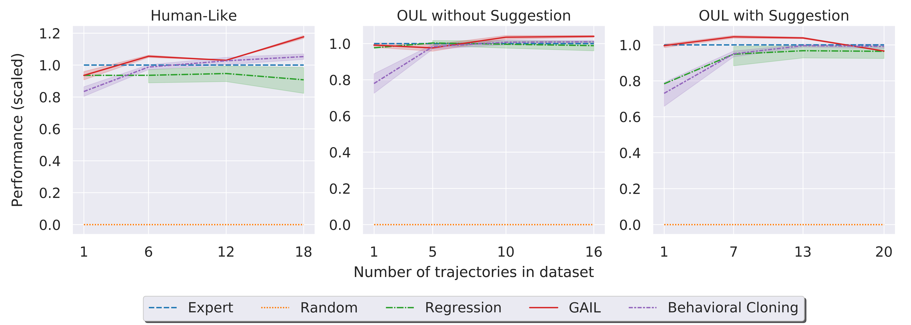

# Learning from Gamettes

This repository contains the code for the CHI 2020 Extended Abstract paper [Learning from Gamettes: Imitating Human Behavior in Supply Chain Decisions](https://dl.acm.org/doi/abs/10.1145/3334480.3382996) for imitating the behavior of [Gamette](https://dl.acm.org/doi/abs/10.1145/3313831.3376571) players in supply chain decisions. The code compares the performance of a nonlinear regression model with [Behavioral Cloning](http://www.cse.unsw.edu.au/~claude/papers/MI15.pdf) and [Generative Adversarial Imitation Learning (GAIL)](https://proceedings.neurips.cc/paper/2016/file/cc7e2b878868cbae992d1fb743995d8f-Paper.pdf).  

The code uses gameplay trajectories and decisions of human players who interacted with the [CRISP](https://gitlab.com/syifan/crisp) simulation through a Gamette environment. For the imitation learning task, the repository relies on a partially observable environment called *gym-crisp* which I developed using [OpenAI's Gym](https://gym.openai.com/) toolkit. 

## Dependencies

1. TensorFlow 1.14.0
2. Stable Baselines 2.10.2a1
3. Gym 0.18.0

## Dataset
The dataset used for imitation includes players' decisions collected using a Gamette in 3 conditions in a between-subject experimental setting. The experimental conditions include variations depending on the type of simulation agents that players interacted with (i.e., Human-like vs. Order-Up-To-Level (OUL) agents) and whether or not players received a suggestion on optimal decision in case they interacted with OUL agents (OUL with suggestion vs. OUL without suggestion).

## Hierarchical Clustering
Since Behavioral Cloning and GAIL rely on multiple trajectories per human expert, we performed a clustering analysis on players’ actions over time for each of the three conditions in our dataset, and used the largest clusters of players as expert trajectories to be used for each algorithm.

## Performance
We tested the performance of each algorithm by considering different number of trajectories in the training set using a sorted list of players based on their total cost from the major cluster.

